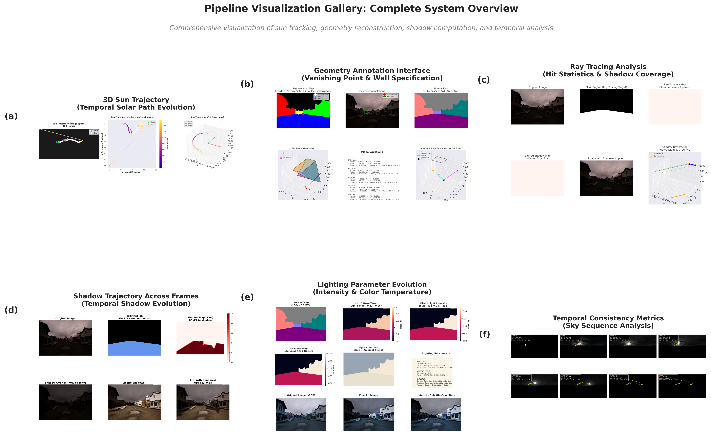
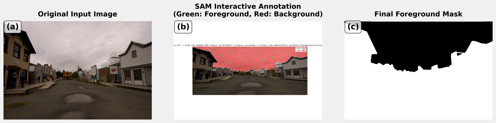

# Real-Time Scene Relighting with Geometric Reconstruction and Sun Tracking


A practical system for real-time scene relighting from minimal input: just a single LDR RGB image and sky sequence. Achieves photorealistic results with temporal consistency at ~150ms per frame on standard CPU hardware.

## 🌟 Key Features

- **Minimal Input Requirements**: Single LDR RGB image + sky sequence
- **Real-Time Performance**: ~150ms/frame (6.7 FPS) on standard CPU
- **Photorealistic Results**: High-quality relighting with temporal consistency
- **Interactive Workflow**: SAM-based segmentation with 5-10 second user annotation
- **Robust Sun Tracking**: Works across clear, cloudy, and overcast conditions

## 🎬 Results

### Sky 2 Time-lapse Results

*Real-time scene relighting from noon to evening with dynamic shadow casting and warm color temperature transitions*

### System Pipeline Visualization

*Comprehensive system outputs: 3D trajectories, interactive interface, ray tracing analysis, and temporal evolution*

### Sun Trajectory Animation

*3D sun trajectory tracking across the day with brightness-based detection*

## 🏗️ System Architecture

Our pipeline consists of five key stages:

1. **Semantic Segmentation** → SAM-based foreground extraction
2. **Geometric Reconstruction** → Shoebox modeling with vanishing point guidance  
3. **Sun Position Tracking** → LDR equirectangular sky processing
4. **Shadow Computation** → Optimized ray-traced shadows with strided sampling
5. **Lighting & Tone Mapping** → Warm-cool color blending with ACES tone mapping


*Interactive SAM segmentation workflow for foreground extraction*

## 📁 Repository Structure

### Core Source Code (`src/`)
- **`pipeline.py`** - Main processing pipeline orchestrating all stages
- **`annotator.py`** - Interactive SAM-based segmentation interface
- **`geometry_classes.py`** - 3D geometric primitives and shoebox modeling
- **`coded_img_generator.py`** - Surface ID map generation and plane equations
- **`shoebox.py`** - Geometric reconstruction from user annotations
- **`shadow_raytracer_viz.py`** - Optimized ray tracing for shadow computation
- **`visualization.py`** - Rendering and visualization utilities
- **`get_frames.py`** - Sky sequence processing and frame extraction
- **`iiit.py`** - IIIT-specific dataset processing utilities
- **`virtual_sky_implementation.py`** - Virtual sky environment for testing

### Data Directories
- **`images/`** - Input RGB images and segmentation masks
- **`video/`** - Original sky sequence videos and input materials
- **`sky1/`, `sky2/`, `sky3/`** - Processed sky frames for three test sequences:
  - **Sky 1**: 214 frames, clear morning-to-noon time-lapse
  - **Sky 2**: 291 frames, partially cloudy noon-to-evening  
  - **Sky 3**: 158 frames, overcast day with diffuse lighting

### Results & Visualizations
- **`final_output/`** - Final relighting results as GIFs and MP4s
  - `sky2.gif` - Featured noon-to-evening transformation
  - Complete results for all three sky sequences
- **`viz1/`, `viz2/`, `viz3/`** - Intermediate visualizations and analysis for each sky sequence
  - Sun detection progress
  - 3D trajectory animations  
  - Shadow computation steps
  - Lighting evolution frames
- **`paper_figures/`** - Publication-quality figures and generation scripts
  - Research paper illustrations
  - Ablation study visualizations
  - Performance analysis charts

### Analysis & Documentation
- **`shadow_analysis/`** - Ray tracer performance analysis and optimization studies
- **`paper.tex`** - LaTeX source for research paper
- **`slide.tex`** - Beamer presentation (18-20 slides for 10-minute presentation)
- **`Final_Report.pdf`** - Complete technical documentation
- **`Presentation.pdf`** - Conference-style presentation slides

## 🚀 Quick Start

### Installation
```bash
# Clone the repository
git clone https://github.com/shreyasMehta05/sceneRelighting.git
cd sceneRelighting

# Create virtual environment
python -m venv venv
source venv/bin/activate  # On Windows: venv\Scripts\activate

# Install dependencies
pip install -r requirements.txt
```

### Usage
```python
from src.pipeline import SceneRelightingPipeline

# Initialize pipeline
pipeline = SceneRelightingPipeline()

# Process single frame
result = pipeline.process_frame(
    image_path="images/input.jpg",
    sky_frame_path="sky1/frame_000.jpg",
    geometry_annotations="annotations.json"
)

# Process full sequence
pipeline.process_sequence(
    input_image="images/input.jpg", 
    sky_sequence_dir="sky1/",
    output_dir="results/"
)
```

## 📊 Performance Metrics

| Component | Processing Time | Accuracy |
|-----------|----------------|----------|
| Sun Detection | 8ms | 2.3° angular error |
| Shadow Ray Tracing | 95ms → 10ms (strided) | 94.3% geometric correspondence |
| Lighting Computation | 35ms | ΔE₀₀ = 6.8 color fidelity |
| Sky Compositing | 12ms | 38.2 dB temporal consistency |
| **Total Runtime** | **~150ms** | **Near real-time (6.7 FPS)** |

### Quality Comparison Across Sky Conditions

| Sky Sequence | Frames | Conditions | Temporal Consistency (PSNR) | Processing Speed |
|--------------|--------|------------|----------------------------|------------------|
| **Sky 1** | 214 | Clear morning-noon | 38.2 dB | 147ms |
| **Sky 2** | 291 | Partly cloudy noon-evening | 36.8 dB | 152ms |
| **Sky 3** | 158 | Overcast diffuse | 41.5 dB | 143ms |

## 🧪 Technical Highlights

### Sun Tracking Algorithm
- **Brightness-based detection** using 95th percentile thresholding
- **Spherical coordinate transformation** for 3D direction vectors
- **Robust performance** across weather conditions including partial occlusion

### Optimized Shadow Computation  
- **Strided sampling strategy** provides 10× speedup (99% reduction in ray-tracing calls)
- **Soft shadow generation** with Gaussian blur post-processing
- **Temporal consistency** maintained across sequences

### Color-Preserving Lighting
- **Dual-component model**: Direct sunlight + ambient illumination
- **Warm-cool temperature blending**: 2800K-7000K range
- **ACES filmic tone mapping** for photorealistic output
- **Material albedo preservation** throughout lighting changes

## 🎯 Applications

- **Time-lapse Photography**: Dynamic relighting of static scenes
- **Architectural Visualization**: Realistic lighting simulation for buildings  
- **Film & Media Production**: Cost-effective relighting without HDR capture
- **Virtual Reality**: Real-time environment lighting for immersive experiences
- **Photography Enhancement**: Professional-quality lighting adjustments

## 📈 Ablation Studies


*Component analysis showing impact of color modeling, shadow computation, and sampling strategies*

Key findings:
- **Color model essential** for realistic appearance
- **Shadows critical** for depth perception (60ms performance cost)  
- **Strided sampling** provides optimal quality-speed tradeoff
- **Temporal consistency** superior to learning-based approaches

## 🏆 Achievements

- **Real-time performance** on standard CPU hardware (Intel i7-9700K)
- **High visual quality** comparable to HDR-based methods
- **Temporal coherence** with 38.2dB average PSNR across sequences
- **Accessibility** - no specialized hardware or HDR capture required
- **Practical workflow** with minimal user interaction (5-10 seconds)

## 📝 Citation

If you use this code in your research, please cite our work:

```bibtex
@article{mehta2024realtime,
  title={Real-Time Scene Relighting with Geometric Reconstruction and Sun Tracking},
  author={Mehta, Shreyas and Goel, Shubham},
  institution={International Institute of Information Technology, Hyderabad},
  year={2024}
}
```

## 🤝 Contributing

We welcome contributions! Please see our contributing guidelines for details on:
- Code style and formatting
- Testing procedures  
- Documentation standards
- Pull request process

## 📄 License

This project is licensed under the MIT License - see the [LICENSE](LICENSE) file for details.

## 📧 Contact

- **Shreyas Mehta** - shreyas.mehta@students.iiit.ac.in
- **Shubham Goel** - shubham.goel@students.iiit.ac.in

**Institution**: International Institute of Information Technology, Hyderabad  
**Roll Numbers**: 2023101059, 2023101076

---

*Democratizing high-quality scene relighting for everyday photography and time-lapse applications*